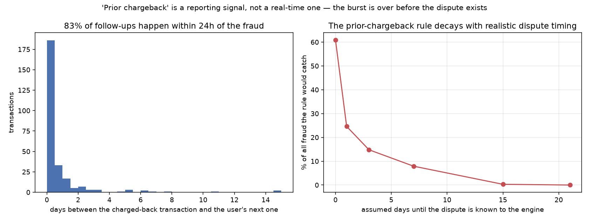
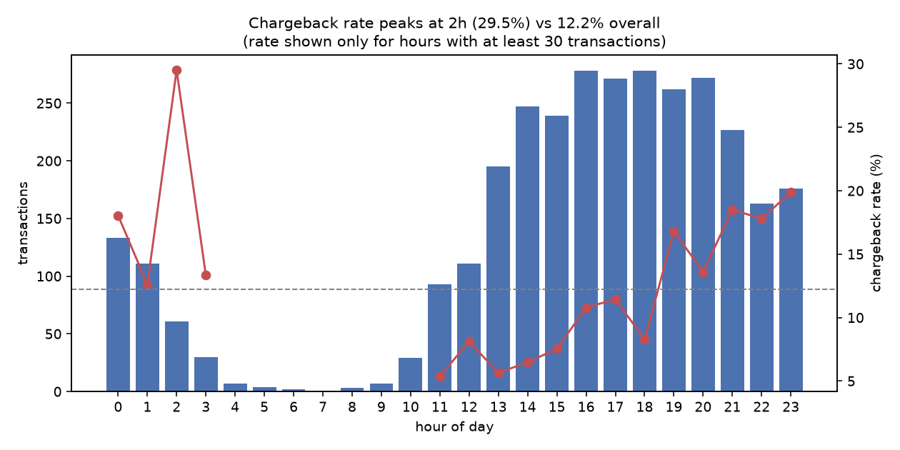
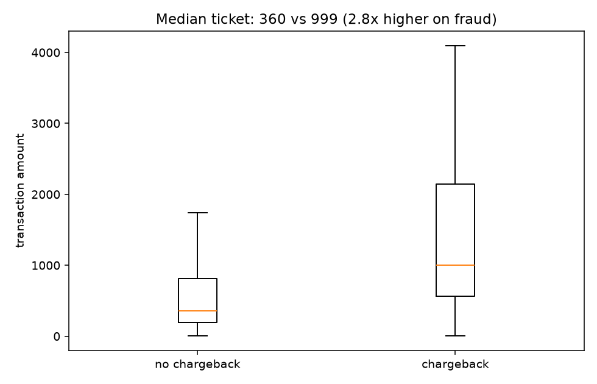
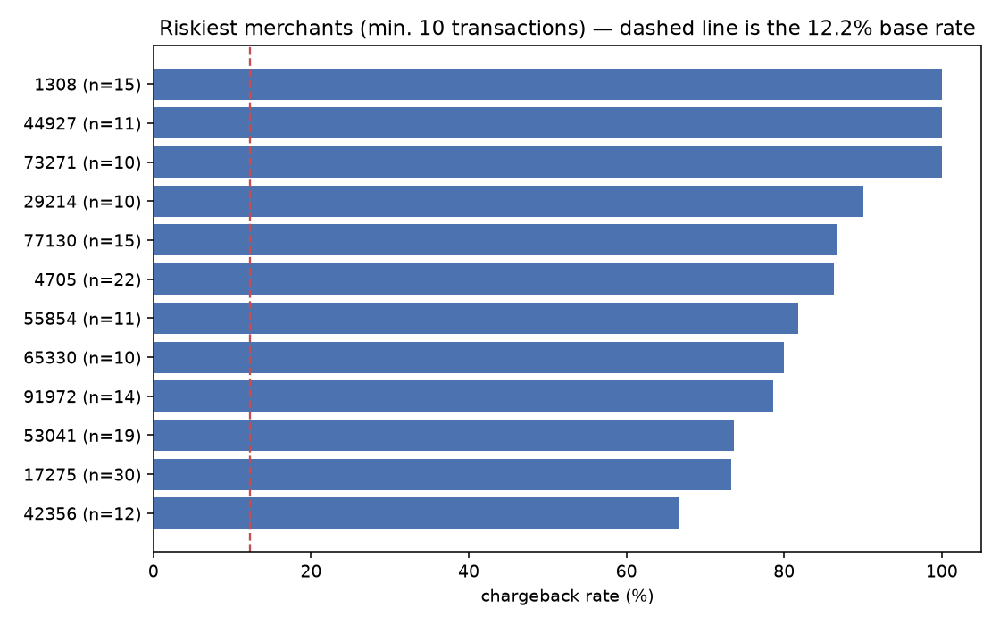
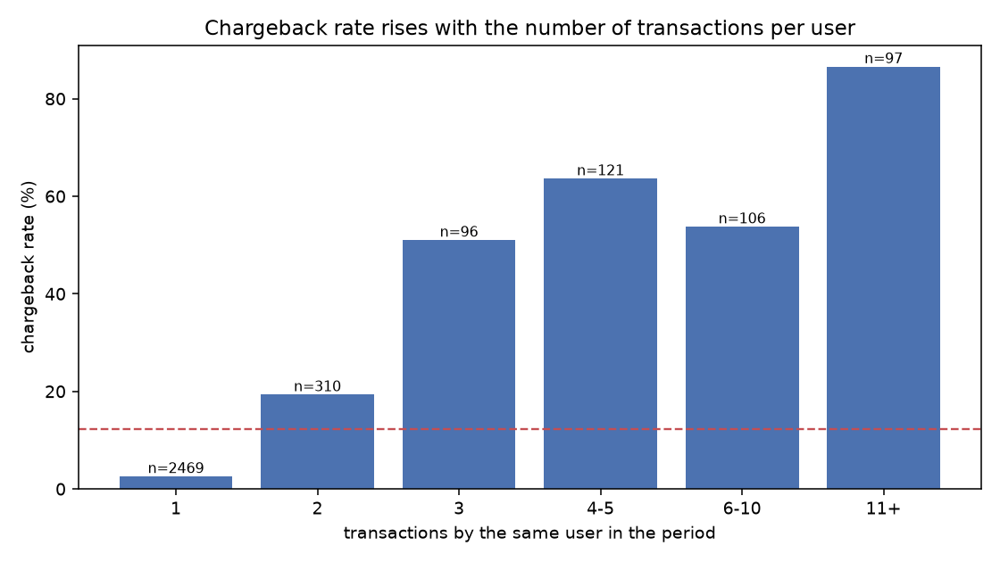
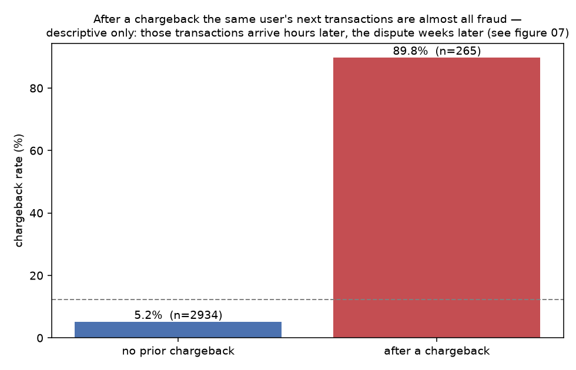
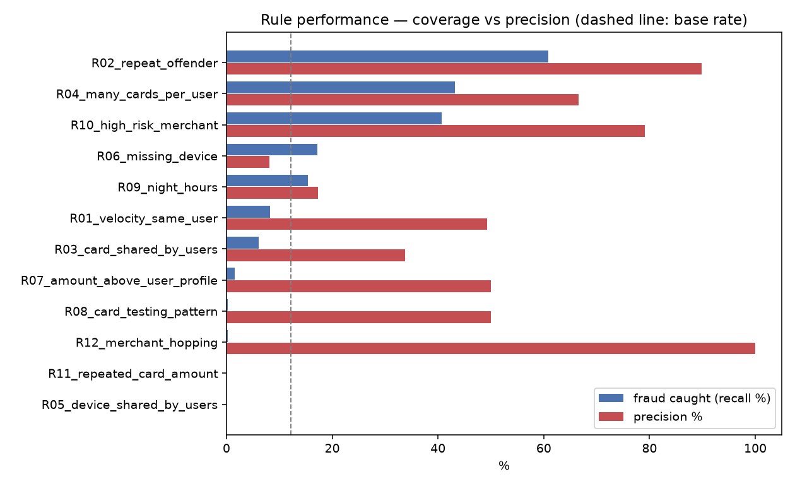
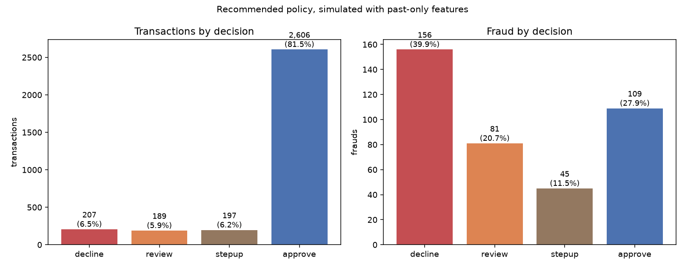

# Card-Not-Present Fraud Analysis

Analysis of **3,199 card-not-present transactions** (2019-11-01 to 2019-12-01) to identify
suspicious behaviour, size the loss, and recommend a prevention policy that can actually run at
authorization time.

**Chargeback rate: 12.22%** — 391 of 3,199 transactions, carrying **568,346.62** of disputed
volume out of **2,456,233.48** processed (**23.1% of all money moved**).

> ### 📊 Data dictionary
> Every column of both datasets — meaning, formula, measured profile, and whether it is safe to
> use in a real-time rule.
>
> **➡️ [Browse it as a spreadsheet](https://docs.google.com/spreadsheets/d/1RAcqoFj2LyJE-MhhAPq-hg_ulXXaRvvGzY4wbElGMnE/edit?gid=1689652905#gid=1689652905)**
>
> Also as [notes](docs/data_dictionary.md) · [raw CSV](outputs/data_dictionary_raw.csv) ·
> [processed CSV](outputs/data_dictionary_processed.csv), generated by
> [`scripts/04_data_dictionary.py`](scripts/04_data_dictionary.py).

---

## TL;DR

1. **The cheapest control needs no chargeback at all.** Capping a merchant at **5 transactions
   in its first 48 hours** blocks 61 transactions, of which **53 are fraud (86.9% precision,
   68,838 — 12.1% of all disputed volume)**, at a cost of **8 legitimate transactions (4,211)**.
   It fires before any dispute exists, which is why it reaches the burst-and-vanish merchants
   that monitoring cannot.
2. **Fraud arrives in bursts.** All 391 chargebacks belong to 153 users (5.7% of users, 14.2% of
   transactions), median activity span **19.3 hours**. Velocity and card cycling — both known
   instantly — are what detect it.
3. **The strongest-looking signal is a timing illusion.** Transactions after a user's previous
   chargeback are 89.8% fraudulent, but **83% happen within 24 hours** of the disputed
   transaction. With a realistic dispute delay the same rule falls from 60.9% of all fraud to
   **24.6% at one day and 7.9% at a week**.
4. **A simple real-time policy stops 39.9% of fraud outright** (211,226 protected) at a cost of
   **51 transactions from 29 distinct customers** (59,256), and routes another 32.2% to review
   or 3DS.
5. **Read the numbers with two caveats.** The month contains a demand peak (Black Friday: 69% of
   volume, 83% of fraud) and the sample is fraud-enriched (12.22% vs ~1% in production). At a 1%
   base rate the decline tier's precision falls from 75.4% to **18.2%**, and the money ratio
   inverts from 0.28 to **~3.9 of legitimate volume per 1.00 of fraud prevented** (sections 3.3
   and 6.4).

Every number comes from the scripts in this repository. Where a number depends on an assumption,
the assumption is stated next to it.

---

## 1. Data

Single file, 3,199 rows, 8 columns, all card-not-present.

| Column | Description | Note |
|---|---|---|
| `transaction_id` | transaction identifier | no duplicates |
| `merchant_id` | merchant receiving the payment | 1,756 distinct — 1,242 with a single transaction |
| `user_id` | cardholder | 2,704 distinct, 1.18 transactions each |
| `card_number` | masked card (BIN + last 4) | 2,925 distinct, used as a pseudo-identifier |
| `transaction_date` | timestamp, microsecond precision | 2019-11-01 to 2019-12-01 |
| `transaction_amount` | amount | median 415.94, max 4,097.21 |
| `device_id` | device used | **830 missing (25.95%)** |
| `has_cbk` | fraud-related chargeback | the target — 391 true (12.22%) |

**Not in the data**, and what it costs us: authorization status (approved/declined), issuer
response code, CVV/AVS result, 3DS/ECI, IP and geolocation, MCC, account age, installments,
chargeback reason and date. Section 4 turns this into a prioritised data request.

The enriched dataset adds 15 derived columns on top of these 8. All 31 fields — including which
ones are safe for a real-time rule and which are descriptive only — are documented in the
**[data dictionary](docs/data_dictionary.md)**
([spreadsheet](https://docs.google.com/spreadsheets/d/1RAcqoFj2LyJE-MhhAPq-hg_ulXXaRvvGzY4wbElGMnE/edit?gid=1689652905#gid=1689652905)).

### Assumptions and limitations

- Currency and timezone are not declared; a single currency and timezone are assumed.
- `BIN + last4` is a card pseudo-identifier — collisions possible, unlikely at this volume.
- Missing `device_id` is kept as its own category, never dropped.
- `has_cbk` carries **no dispute date**, so the dispute delay has to be simulated (3.2). Note
  that the chargeback rate *rises* at the end of the window (17–19% over the last four days),
  which is not what an immature label looks like — either the snapshot is late and labels are
  mature, or the peak-week fraud is worse than measured. Both readings favour the conclusions
  here; neither is provable from this file.
- **The sample is fraud-enriched.** 12.22% is far above production reality, where scheme
  monitoring programmes trigger around 1%. Patterns generalise; precision and money ratios do
  not (6.4).
- **The month is not homogeneous** (3.3).
- `user_id` behaves like a merchant-side customer id: only 0.9% of users appear at more than one
  merchant. Any rule keyed on it is one new sign-up away from being bypassed (6.5).

---

## 2. Method

1. **Load and order** — type the columns, sort chronologically.
2. **Quality checks** — nulls, duplicates, non-positive amounts, period continuity.
3. **Enrichment** — hour, BIN, entity counts, time since the user's previous transaction, amount
   relative to the user's own history.
4. **Signal testing** — twelve hypotheses tested against the 12.22% base rate, kept only where
   the data supports them.
5. **Rule measurement** — precision, recall and alerts-per-fraud for each rule.
6. **Streaming replay** (`scripts/03_impact.py`) — the base is replayed transaction by
   transaction with **past-only features**; every chargeback-derived feature (user *and*
   merchant) is re-tested under a range of dispute delays, and merchant action is credited only
   with the loss that occurs **after** its trigger fires. Only what survives this step is
   recommended.

---

## 3. Findings

### 3.1 The seven findings

| # | Finding | Evidence | Recommended action | Cost |
|---|---|---|---|---|
| F1 | **Fraud rides on brand-new merchants, and volume ramp catches it without any label** | Capping a merchant at 5 transactions in its first 48h: 61 blocked, **53 fraud (86.9% precision)**, 68,838 — **12.1% of disputed volume**. At 3 transactions/48h: 141 blocked, 104 fraud (73.8%), **26.1%** of disputed volume | Volume ramp limit plus settlement hold for new merchants | 8 legitimate transactions (4,211) at the 5/48h setting; 37 (20,305) at 3/48h |
| F2 | **Fraud comes in short bursts by the same user** | From the user's 2nd transaction in 24h: 60.9% precision, 56.5% of all fraud (363 alerts). From the 3rd: **77.1% precision**, 33.5% (170 alerts) | Velocity limit: review from the 2nd, decline from the 3rd | 39 legitimate transactions from 23 customers (46,934) |
| F3 | **Accounts cycle through cards** | 2nd distinct card: 75.0% precision, 36.8% of fraud. 3rd card: **79.4% precision**, 26.6% | Distinct-card limit: review at the 2nd, decline at the 3rd | 27 legitimate transactions from 17 customers (23,044) |
| F4 | **Risk rises sharply with ticket size** | Bottom three amount deciles 1.9–3.4% chargeback; top decile (>2,075) **33.1%** | 3DS step-up above the 90th percentile of past amounts — not a hard cap | friction on 152 legitimate transactions; the sale survives authentication (assumption, see 6.2) |
| F5 | **Merchant chargeback history is a slow signal, and this portfolio is too young for it** | A batch on 3+ transactions and 2+ known disputes, acting one cycle later, stops **18.2% of disputed volume with instant labels and 6.9% at a 3-day label delay**. With the original 10-transaction trigger: 3.8%. Only 30 of 1,756 merchants ever reach 10 transactions; 70.7% have exactly one | Keep merchant risk as a **daily batch** with a low trigger (3+ transactions, 2+ disputes), and expect it to work properly only with months of history | 26 legitimate transactions (23,682) across 42 merchants |
| F6 | **Night hours are elevated but weak** | 00:00–05:59: 346 transactions, 17.3% precision (peak 02:00 at 29.5% over 61 transactions) | Score factor only — never a standalone block | Blocking the window would cost 286 legitimate transactions for 60 frauds |
| F7 | **Missing device is *not* a fraud signal here** | 830 transactions without `device_id`: **8.1%** chargeback vs 13.7% with device — below the base rate | Do not build a rule on it; still close the collection gap, since a 26% blind spot caps every device rule | Hypothesis rejected — a rule here would have produced 763 false positives |

**Overlap matters.** F2 and F3 fire on 170 and 131 transactions, but 94 are the same transactions
(79 of them fraud). Their union is **207**, not 301 — coverage cannot be added up.

**A tempting finding that does not survive its base rate.** 83 merchants with a chargeback have
a lifespan of two days or less, carrying 55.3% of the disputed volume — which looks like a
headline until you check the other side: **82% of merchants with no chargeback at all are also
short-lived** (1,349 of 1,638), because 70.7% of the portfolio has a single transaction and the
window is only 30 days. On top of that, 36 of those 83 have exactly one transaction (lifespan is
zero by construction) and 27 are still active in the final two days (right-censored). Short
lifespan does not discriminate here, and without a merchant onboarding date it cannot be
measured. What does discriminate is **volume compressed into the first hours** — F1.

### 3.2 F0 — the finding that changed the recommendation

Transactions by a user who already had a chargeback are **89.8% fraudulent** (265 transactions,
60.9% of all fraud). That is the headline of a naive analysis. It is not what it looks like:
**82.6% of those transactions happen within 24 hours** of the charged-back one, while a real
dispute takes days to weeks to reach the acquirer.

Simulating a block list that holds every dispute already mature enough to be known:

| Dispute known after | Transactions flagged | Frauds caught | % of all fraud | Precision |
|---:|---:|---:|---:|---:|
| 0 days (instant, unrealistic) | 265 | 238 | 60.9% | 89.8% |
| 1 day | 116 | 96 | **24.6%** | 82.8% |
| 3 days | 72 | 58 | 14.8% | 80.6% |
| 7 days | 36 | 31 | 7.9% | 86.1% |
| 15 days | 2 | 1 | 0.3% | 50.0% |



Two conclusions, deliberately separated:

- **It cannot stop this attack.** Whatever delay you assume, the burst is over first. The
  operable reading is F2: "repeat offender" is really *the same burst*, detectable instantly by
  velocity, with no label at all.
- **It is still worth buying speed.** At a one-day delay the list would still touch **24.6% of
  all fraud at 82.8% precision** — which is the business case for chargeback-alert feeds
  (recommendation 8), not a reason to drop chargeback history.

The same test was applied to the merchant rule (F5), where it also collapses. Any rule built on
`has_cbk` has to pass it.

### 3.3 The month contains a demand peak

| Period | Transactions | Chargeback rate |
|---|---:|---:|
| 01–20 Nov | 979 | 6.6% |
| 21 Nov – 01 Dec | 2,220 | **14.7%** |

The last 11 days hold **69% of the volume and 83% of the fraud** — Black Friday. The blended
12.22% is the average of two different realities, and the policy performs differently in each
(6.3).

### 3.4 Supporting charts

| | |
|---|---|
|  |  |
|  |  |
|  |  |

---

## 4. Additional data that would improve detection

Ranked by value over effort. Each item is tied to a pattern that is invisible today.

1. **Authorization status and issuer response code.** We only see approved transactions. Card
   testing — dozens of declines before one success — is the most characteristic CNP fraud
   footprint and is entirely absent here: our card-testing rule fired **twice** in 3,199
   transactions for exactly this reason.
2. **Merchant onboarding data (age, category, expected volume, ownership).** The volume-ramp
   control in F1 currently has to use the first *observed* transaction as a proxy for the
   merchant's age, which lets an old low-volume merchant into the cut. A real onboarding date
   turns a ceiling into a measurement — and lets us flag a merchant before its first chargeback.
3. **Account and card age (KYC).** At 1.18 transactions per user there is no behavioural
   baseline. Knowing an account was created minutes before a high-ticket purchase separates a
   new customer from an attack — and the data already exists internally.
4. **IP address and geolocation.** Links accounts that share no card or device, enables
   impossible-travel checks and BIN-country vs IP-country mismatch. It is also the answer to the
   evasion problem in 6.5: an attacker mints `user_id`s freely, but not networks.
5. **Chargeback reason code and dispute date.** Separates fraud from commercial disputes and lets
   us measure label maturity instead of assuming it (3.2).

Items 1, 3, 4 and 5 already exist inside the payment stack and only need to reach the analytical
base. Item 2 sits with the underwriting team. Consortium and bureau data come after, with
per-query cost and contracts.

---

## 5. Recommendations

### Immediate — deployable with today's data

| # | Measure | Threshold | Cost |
|---|---|---|---|
| 1 | **New-merchant volume ramp** + settlement hold | max 5 transactions in the merchant's first 48h (tighten to 3 for more coverage) | 8 legitimate transactions (4,211) for 53 frauds — 86.9% precision, 12.1% of disputed volume. At 3/48h: 26.1% coverage for 37 legitimate transactions |
| 2 | **Merchant monitoring batch** (daily) | 3+ transactions and 2+ known disputes → investigate, hold, offboard | acting one cycle later: 18.2% of disputed volume with instant labels, 6.9% at a 3-day label delay, 26 legitimate transactions affected — quote the delayed figure, it is the real one |
| 3 | **Velocity limit per user** | review from the 2nd transaction in 24h, decline from the 3rd | 39 legitimate transactions, 23 customers (46,934), for 131 frauds |
| 4 | **Distinct-card limit per account** | review at the 2nd card, decline at the 3rd | 27 legitimate transactions, 17 customers (23,044), for 104 frauds |
| 5 | **3DS step-up above the 90th percentile of amount** | expanding quantile over past amounts | friction on 152 legitimate transactions; abandonment cost unknown (6.2) |
| 6 | **Block lists** (card, device, user confirmed in fraud) | consulted before scoring | near zero if curated — this is the right home for chargeback history (3.2) |

### Structural — need a project

7. **Manual review queue** with defined capacity: **5.9% of the flow** (~6/day at this volume —
   quote the percentage, since headcount scales with volume).
8. **Chargeback-alert feed / faster dispute data.** 3.2 quantifies the prize: a one-day label
   reaches 24.6% of fraud at 82.8% precision, against 0.3% at fifteen days.
9. **Mandatory device fingerprint and IP collection** — 26% of the base has no device today.
10. **Tighter merchant underwriting** — the structural version of recommendations 1 and 2.
11. **Keys beyond `user_id`** (card, device, BIN) so the policy survives account rotation (6.5).

---

## 6. Proposed anti-fraud solution

### 6.1 Architecture

```
   TRANSACTION
        |
        v
  [1] INGESTION          validate and normalise
        |
        v
  [2] REAL-TIME FEATURES counters over the last 1h / 24h / 30d, keyed on
        |                user, card, device and BIN            (in-memory store)
        v
  [3] LISTS              block / allow  -> immediate decision
        |
        v
  [4] RULES              explainable thresholds (section 5)
        |
        v
  [5] SCORE              model for the combinations rules miss  (phase 2)
        |
        v
  [6] DECISION POLICY    decline | review | 3DS step-up | approve
        |
        v
   RESPONSE (tens of milliseconds)
        |
        +--> [7] DAILY BATCH: merchant risk, ratio monitoring, settlement holds, offboarding
        |
        +--> [8] FEEDBACK: chargebacks (days to weeks later) + analyst outcomes
                 -> refresh block lists, recalibrate thresholds, retrain the model
```

Chargeback data belongs in blocks [3], [7] and [8] — slow decisions tolerate a slow label. Block
[6] cannot use it at all: that is the lesson of 3.2.

### 6.2 Decision policy, simulated with past-only features

- **Decline** — 3rd transaction of the user within 24h, **or** account already on 3+ distinct
  cards.
- **Manual review** — 2nd transaction within 24h, or 2nd distinct card.
- **3DS step-up** — amount above the expanding 90th percentile of past amounts (automatic, no
  analyst cost).
- **Approve** — everything else.

Merchant risk is deliberately *not* a real-time tier here: under a realistic dispute delay it
fires on a single transaction in this window. It runs as the daily batch of recommendation 2.

| Tier | Transactions | Share | Frauds | Precision | Fraud amount in tier | Legitimate affected |
|---|---:|---:|---:|---:|---:|---|
| Decline | 207 | 6.5% | 156 | 75.4% | **211,226 prevented** | 51 transactions / **29 customers** (59,256) |
| Manual review | 189 | 5.9% | 81 | 42.9% | 92,075 *(routed, not prevented)* | 108 transactions / 103 customers |
| 3DS step-up | 197 | 6.2% | 45 | 22.8% | 152,268 *(challenged, not prevented)* | 152 transactions / 148 customers |
| Approve | 2,606 | 81.5% | 109 | residual 4.2% | 112,778 lost | — |

Only the decline row is money prevented. **39.9% of fraud is stopped outright**, another **32.2%
is routed** to a human or to an authentication challenge, and **27.9% still reaches approval**.
81.5% of the base is approved with no friction.



**Two stated assumptions, not measurements.**

- *Review queue.* No analyst-outcome data exists. The queue holds 92,075 of fraud and 77,523 of
  legitimate value, so — assuming an analyst is equally accurate on both sides — it is
  value-positive above **46% accuracy**. That is a low bar, but it is arithmetic on an
  assumption.
- *3DS step-up.* There is no ECI/3DS field and no abandonment data in this base. "The sale
  survives authentication" is a premise: a challenge on high-ticket transactions does cost
  conversion, and this tier touches 148 legitimate customers. Measure abandonment before rolling
  it out broadly.

### 6.3 The same policy outside the peak

| Period | Tier | Transactions | Frauds | Recall | Precision |
|---|---|---:|---:|---:|---:|
| 01–20 Nov (normal) | decline | 29 | 19 | 29.2% | 65.5% |
| 21 Nov–01 Dec (peak) | decline | 178 | 137 | 42.0% | 77.0% |

The headline figures are the blended month. In a normal week the same thresholds catch less and
err more — expected behaviour for a velocity rule, and the reason thresholds must be re-tuned per
season rather than set once.

### 6.4 Scenario: a realistic base rate

This sample carries 12.22% fraud against roughly 1% in production, so legitimate volume is
under-represented by about **13.8×**. Holding the same lift and reweighting:

| Metric | This sample | Scenario at 1% |
|---|---:|---:|
| Decline-tier precision | 75.4% | **18.2%** |
| Legitimate transactions blocked per fraud | 0.33 | **4.5** |
| Legitimate volume lost per 1.00 of fraud prevented | 0.28 | **~3.9** |

**Premise:** the missing legitimate volume behaves like the observed one. How the sample was
enriched is unknown, and different enrichment schemes push this in opposite directions — treat
the column as a scenario, not a measurement. The rule keeps an 18× lift over the base rate, but
**no auto-decline should be switched on before re-tuning on production data**; the review and
step-up tiers absorb this uncertainty far better than a hard block.

### 6.5 How this is evaded, and the plan B

Only **0.9% of users** transact at more than one merchant and the average is 1.18 transactions
per user: `user_id` is a merchant-side customer identifier, created by the attacker at sign-up.
Every rule in 6.2 is keyed on it, so evasion costs one new registration — exactly the profile of
the 109 frauds still in the approve tier (single transaction, no history).

Plan B, in order: key the same counters on **card**, **device** and **BIN**; close the 26% device
gap; add IP and account age (section 4) so identity can be linked across accounts. Rules keyed on
attacker-controlled fields are a starting point, never the endpoint.

### 6.6 Why rules before a model

The rules above are auditable, tunable in minutes, and reach 75% precision on the decline tier. A
model is the right phase-2 investment — logistic regression or a gradient-boosted tree, **temporal
split**, evaluated on precision/recall and PR-AUC rather than accuracy — but it must beat this
baseline to earn its place. Two constraints carry over: no feature may use information
unavailable at authorization time, and any target built from `has_cbk` inherits the label lag of
3.2.

---

## 7. Payments industry context

Money flow and information flow, acquirer vs sub-acquirer vs gateway, chargebacks vs
cancellations, and what an anti-fraud system is:
**[docs/payments_industry.md](docs/payments_industry.md)**.

---

## How to run

```bash
python -m venv .venv
```

```bash
.venv\Scripts\activate
```

```bash
pip install -r requirements.txt
```

```bash
python scripts/00_download_data.py
```

```bash
python scripts/01_eda.py
```

```bash
python scripts/02_rules.py
```

```bash
python scripts/03_impact.py
```

```bash
python scripts/04_data_dictionary.py
```

| Script | Output |
|---|---|
| `00_download_data.py` | downloads the CSV to `data/raw/` and prints the sanity checks |
| `01_eda.py` | cleaning, feature engineering, figures 1–5, `data/processed/transactions_enriched.csv` |
| `02_rules.py` | 12 descriptive rules measured, `outputs/alerts.csv`, `outputs/rule_performance.csv`, figure 6 |
| `03_impact.py` | streaming replay with past-only features, dispute-delay tests, prospective merchant impact, policy simulation, regime and prevalence scenarios, figures 7–8 |
| `04_data_dictionary.py` | `outputs/data_dictionary_raw.csv` and `outputs/data_dictionary_processed.csv` — see [docs/data_dictionary.md](docs/data_dictionary.md) |

`02_rules.py` is descriptive — it uses whole-period columns and is useful for exploring signals.
**`03_impact.py` is the one to trust for anything operational**: it is the only view built with
past-only features. One known simplification: the step-up threshold is an expanding quantile that
needs 200 transactions before it activates, so it is inactive for the first week; production
should use a rolling window instead, or the threshold eventually freezes.

Data is not versioned; `00_download_data.py` reproduces it from source.
